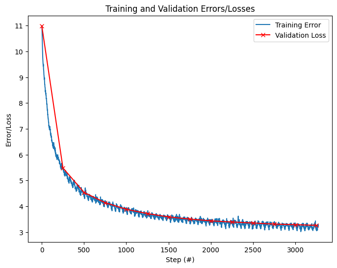

# mamba-distributed

Mamba paper: https://arxiv.org/pdf/2312.00752

Mamba-2 paper: https://arxiv.org/pdf/2405.21060
## How to train a model
### Environment set up
    pip install -r requirements.txt

### Download the data
    import your own data

### Train the model
This model has been trained on 8 A100 GPU cards on a single node, and it takes about 2 hours to train a model with 1 epoch.

    torchrun --standalone --nproc_per_node=8 train.py

### Evaluate the model

**HellaSwag**
To evaluate the model, I used the hellaswag benchmark. The evaluation results are shown below:

| Model Name | Parameters | Benchmark Name | Score |
| --- | --- | --- | --- |
| Mamba-2 (Mine)| 280M |hellaswag | 0.324 |
| [Mamba-2](https://huggingface.co/state-spaces/mamba2-370m) (HF) | 370M |hellaswag | 0.299 |
| GPT-2 | 124M |hellaswag | 0.294 |
| GPT-2 | 350M |hellaswag | 0.375 |
| GPT-3 | 124M |hellaswag | 0.337 |

**Training/Validation Loss**

In addition, we can follow the traning and validation loss curve to evaluate the model at each step.

